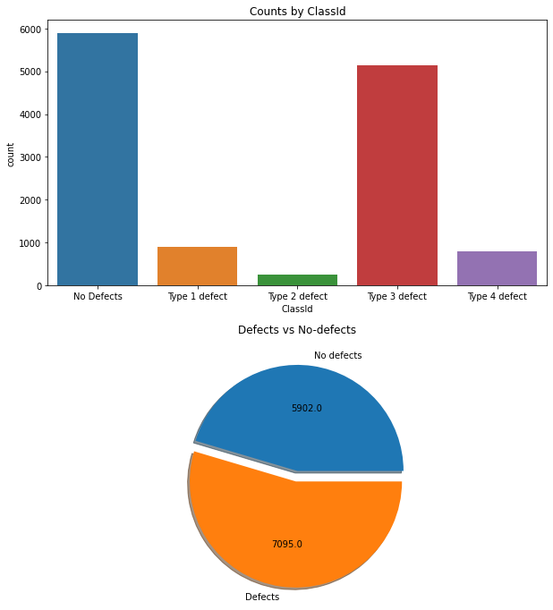
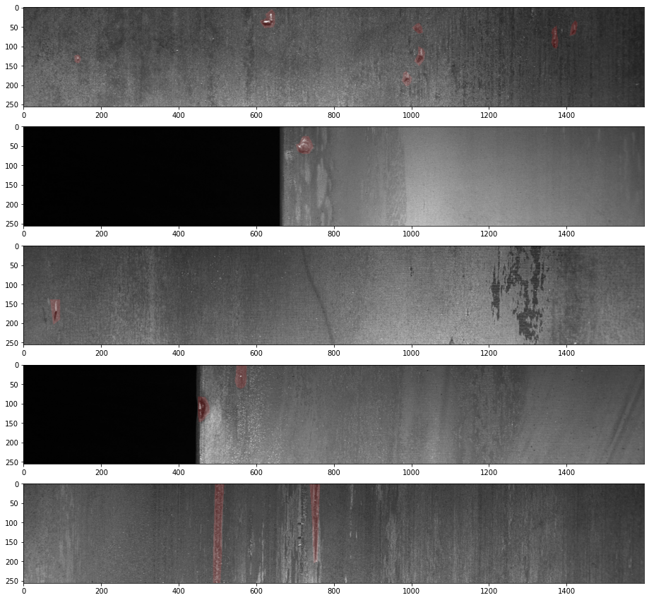
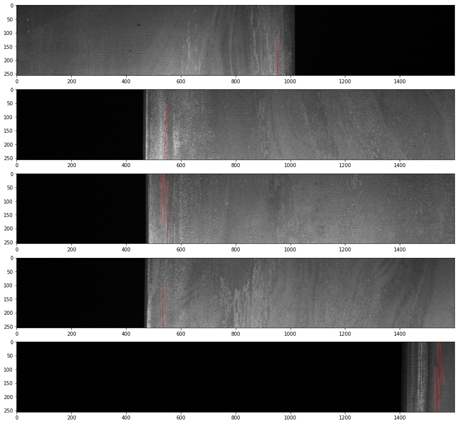
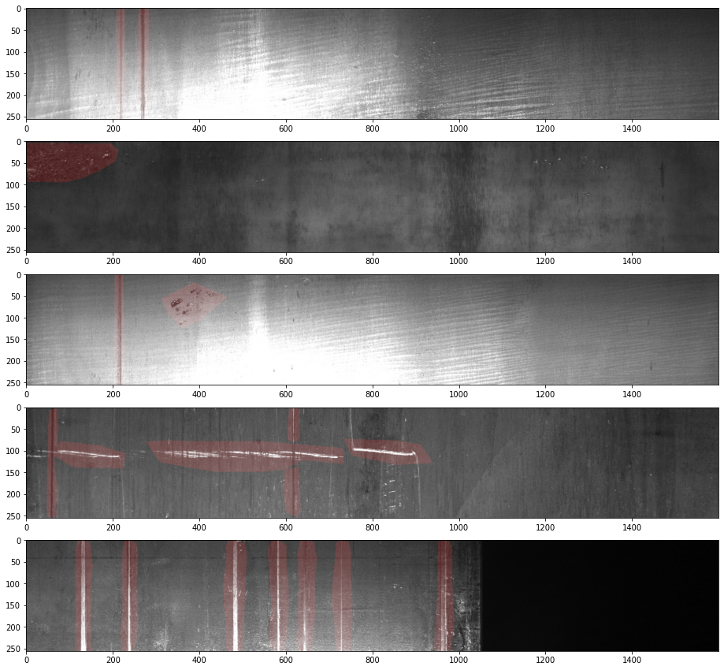
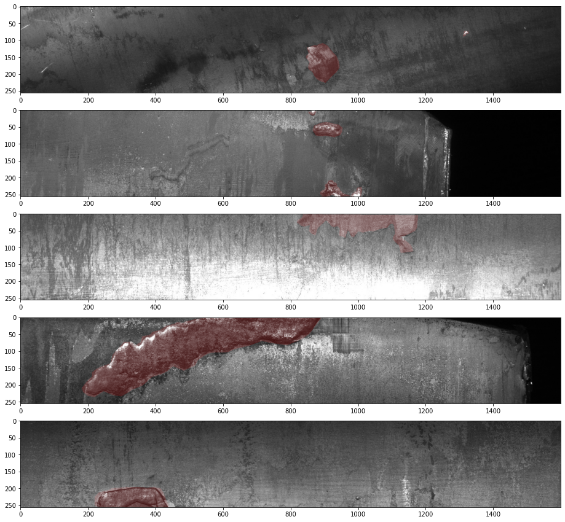

# Severstal: Steel Defect Detection
"In this competition, you’ll help engineers improve the algorithm by localizing and classifying surface defects on a steel sheet."
## Source 
https://www.kaggle.com/c/severstal-steel-defect-detection/overview

## EDA


### Setup


```python
import pandas as pd
import numpy as np
import matplotlib
import matplotlib.pyplot as plt
import glob
import seaborn as sns
import cv2
%matplotlib inline
```


```python
df_train = pd.read_csv('Data/train.csv')
```


```python
def load_images(image_dir, dataframe):
    images = [img.split('/')[2] for img in glob.glob(image_dir + '*.jpg',recursive=False)]
    images_df = pd.DataFrame({'ImageId': images})
    return pd.merge(images_df, dataframe, how='left', on='ImageId')
```


```python
train_images = load_images('Data/train_images/', df_train)
train_images.head()
train_images.ClassId = train_images['ClassId'].fillna(0)
```

### Explore training data


```python
fig, axes = plt.subplots(2,1, figsize=(10,12))
fig.subplots_adjust(hspace = 0.2)
axes[0].set(title = 'Counts by ClassId')
G = sns.countplot(train_images.ClassId, ax=axes[0])
G.set_xticklabels(['No Defects', 'Type 1 defect', 'Type 2 defect', 'Type 3 defect', 'Type 4 defect'], rotation=0)
labels, sizes = ['No defects', 
                 'Defects'],[train_images.ClassId.value_counts().values[0],
                 np.sum(train_images.ClassId.value_counts().values[1:])]

axes[1].pie(sizes, labels=labels, autopct=lambda val: np.round(val/100*np.sum(train_images.ClassId.value_counts().values)), shadow=True, explode= (0, 0.1))
axes[1].set(title = 'Defects vs No-defects')
```


    [Text(0.5, 1.0, 'Defects vs No-defects')]





```python
train_images.ImageId.value_counts()
```


    db4867ee8.jpg    3
    ef24da2ba.jpg    3
    140e59cff.jpg    2
    e5f9a5bb9.jpg    2
    f806c9662.jpg    2
                    ..
    3b9a3ae3b.jpg    1
    75c421bbd.jpg    1
    2e5127c3c.jpg    1
    df76ae5b5.jpg    1
    ff6ec63cf.jpg    1
    Name: ImageId, Length: 12568, dtype: int64


### EncodedPixels


```python
print(train_images.EncodedPixels[1])
print(train_images.ImageId[1])
```

    53378 127 53508 253 53764 253 54020 253 54276 253 54532 253 54787 254 55043 254 55299 254 55555 254 55811 254 56067 254 56323 254 56579 254 56835 254 57090 255 57346 255 57602 255 57858 255 58114 255 58498 127 65761 32 65953 96 66145 160 66337 6240
    9163ec76b.jpg


Pixels have been coded with RLE. In RLE we use pair of numbers: first number (in this context) is starting pixel and second is the running length. So for e.g. ``` '1 5' ``` would imply that starting from pixel 1 and run for total of 5 pixels -> 1,2,3,4,5. The pixels are numbered from top to bottom then left to right: 1 is pixel (1,1), 2 is pixel (2,1), etc


```python
def decode_rle(encodedpixels):
    if encodedpixels == np.nan:
        return np.nan
    try:
        list_of_values = list(map(int, encodedpixels.split(' ')))
    except AttributeError:
        return np.nan
    else:
        list_of_values = list(map(int, encodedpixels.split(' ')))
        encoded_pairs = list(zip(list_of_values[0::2], list_of_values[1::2]))
    return encoded_pairs


def mask_image(encoded_pairs, image):
    img_arr = cv2.imread('Data/train_images/' + image)
    img_arr = img_arr / 255
    if encoded_pairs == np.nan:
        return img_arr
    else:
        try:
            for (start_pixel, run) in encoded_pairs:
                pixels = [i for i in range(start_pixel, start_pixel+run)]
                for pixel in pixels:
                    row = pixel % 256
                    col = (pixel - 1) // 256
                    img_arr[row][col][0] = 1
        except:
            return img_arr
        else:
            for (start_pixel, run) in encoded_pairs:
                pixels = [i for i in range(start_pixel, start_pixel+run)]
                for pixel in pixels:
                    row = pixel % 256
                    col = (pixel - 1) // 256
                    img_arr[row][col][0] = 1
            return img_arr
```


```python
train_images['image_array'] = np.nan
```

### Type 1 defects


```python
type_1_defect_examples = (train_images[train_images['ClassId']==1]).head().values
fig = plt.figure(figsize=(100,15))
for i,row in enumerate(type_1_defect_examples):
    image_file = row[0]
    encoded_pixels = row[2]
    a = fig.add_subplot(5, 1, i+1)
    plt.imshow(cv2.imread('Data/train_images/' + image_file))
    plt.imshow(mask_image(decode_rle(encoded_pixels), image_file), alpha=0.2)
```





### Type 2 defects


```python
type_2_defect_examples = (train_images[train_images['ClassId']==2]).head().values
fig = plt.figure(figsize=(100,15))
for i,row in enumerate(type_2_defect_examples):
    image_file = row[0]
    encoded_pixels = row[2]
    a = fig.add_subplot(5, 1, i+1)
    plt.imshow(cv2.imread('Data/train_images/' + image_file))
    plt.imshow(mask_image(decode_rle(encoded_pixels), image_file), alpha=0.2)
```





### Type 3 defects


```python
type_3_defect_examples = (train_images[train_images['ClassId']==3]).head().values
fig = plt.figure(figsize=(100,15))
for i,row in enumerate(type_3_defect_examples):
    image_file = row[0]
    encoded_pixels = row[2]
    a = fig.add_subplot(5, 1, i+1)
    plt.imshow(cv2.imread('Data/train_images/' + image_file))
    plt.imshow(mask_image(decode_rle(encoded_pixels), image_file), alpha=0.2)
```





### Type 4 defects


```python
type_4_defect_examples = (train_images[train_images['ClassId']==4]).head().values
fig = plt.figure(figsize=(100,15))
for i,row in enumerate(type_4_defect_examples):
    image_file = row[0]
    encoded_pixels = row[2]
    a = fig.add_subplot(5, 1, i+1)
    plt.imshow(cv2.imread('Data/train_images/' + image_file))
    plt.imshow(mask_image(decode_rle(encoded_pixels), image_file), alpha=0.2)
```





```python

```


```python

```
